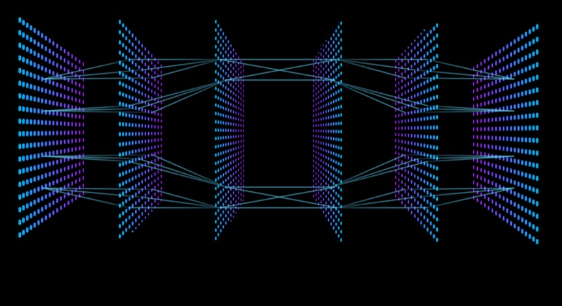

# CMOR 438: Data Science & Machine Learning, Summer 2025
### By Lena Lowry

This repository presents a collection of algorithms developed as part of a machine learning project. Machine learning is broadly categorized into supervised and unsupervised learning. Supervised learning includes both regression and classification tasks, while unsupervised learning encompasses methods like clustering and anomaly detection.

The project follows a standard machine learning workflow: data preprocessing and exploration, model selection, and performance comparison. Models are organized by learning type (supervised vs. unsupervised). The Python language is used for the entire repository and the palmer penguins dataset is used across most models to enable consistent comparisons and highlight key differences between algorithms.

## The algorithms

Supervised Learning:
- K-Nearest Neighbors
- Linear Regression
- Logistic Regression
- Perceptron
- Multilayer Neural Network
- Decision Tree
- Ensemble Learning and Random Forest
Unsupervised Learning:
- Principal Component Analysis
- K-Means Clustering
- DBSCAN