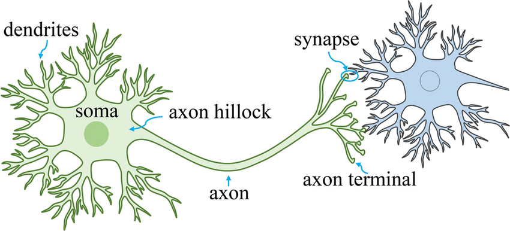

# **The Perceptron Model**

In this file, we examine both the features of a perceptron, as well as the dataset we will be training our model on. 

The perceptron consists of a single "neuron". This biological parallel is drawn because the perceptron is the basic unit of many machine learning models, just as the neuron is the fundamental unit of the brain. Additional comparisons can be drawn between the dendrites of a neuron and the weights of a perceptron, as shown in the images below.

## Components of a perceptron

The perceptron model uses a single neuron to perforn binary classification on a given input, or set of inputs. Inputs are recieved in the form of a vector, which in our case will be measurements of the characteristics of a group of penguins. The model assigns each of these inputs a weight.

