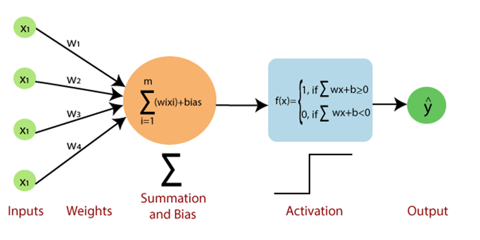

# **The Perceptron Model**

In this file, we examine both the features of a perceptron, as well as the dataset we will be training our model on. 

The perceptron consists of a single "neuron". This biological parallel is drawn because the perceptron is the basic unit of many machine learning models, just as the neuron is the fundamental unit of the brain. Additional comparisons can be drawn between the dendrites of a neuron and the weights of a perceptron, as shown in the images below.

 

## Components of a perceptron

The perceptron model uses a single neuron to perforn binary classification on a given input, or set of inputs. Inputs are recieved in the form of a vector, which in our case will be measurements of the characteristics of a group of penguins. 

The model assigns each of these inputs a weight. Initially, these weights will be chosen randomly on the interval (0,1]. After each iteration, or 'epoch' that the algorithm operates, the weights are refined such that the error value is reduced.

## The dataset

For this model, I used the provided [palmer penguins dataset](palmer_penguins.csv). Some simple data cleanup was required, and is explained in the code breakdown. This dataset provides information from 344 specimens across 3 species of penguins, however for the sake of our binary classification perceptron, I used an abbreviated version of the data, consisting of 219 specimens across 2 species.
I found the "bill length" and "bill depth" features to lead to the the _most_ linearly separable results when used as inputs.

## Packages required

In order to analyze the data and produce the necessary graphs, the following Python packages were utilized:

