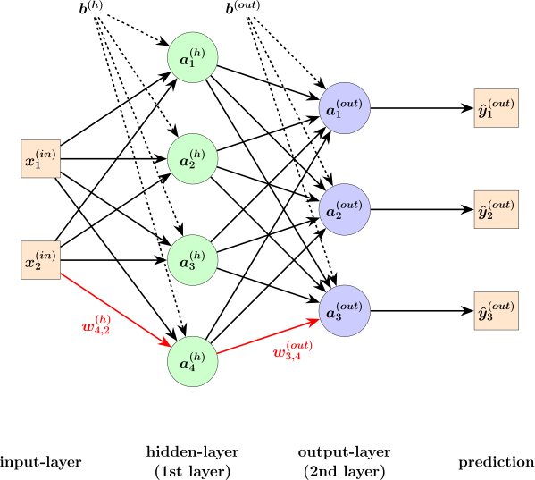

# The Neural Network Model

Now that we have made multiple models consisting of a single neuron, we will layer these neurons to produce a network. In such a model, the outputs of the previous layer become the inputs of the following layer. That means that the activation functions become increasingly composite as we move from layer to layer, until reaching the output vector.



## Image Flattening

In a basic dense neural network, input feature vectors are passed into the first (0-th) layer of the computational graph as column vectors. This initial layer functions similarly to the input layer in a single-neuron model. To input image data into such a network, we must first flatten each image from a matrix into a single column vector.

Since each image is a 28 × 28 matrix, we can flatten it using the```.flatten()``` method and then reshape it with ```.reshape(784, 1)``` to ensure it becomes a column vector with 784 rows, where 784=28×28.

The pixel values in the training and testing datasets range from 0 to 255. These wide numerical ranges can interfere with the training process by causing unstable updates to weights and biases. A simple solution is to normalize the data by scaling all pixel values to fall within the interval (0,1). This can be done by dividing each entry by the maximum pixel value, 255.

## One Hot Encoding

One-hot encoding is a method for representing categorical variables as binary vectors. It’s commonly used in machine learning to make non-numeric labels usable by algorithms that require numeric input. In our case, clothing items are non-numeric, but they have been indexed with numbers 0-9. As a example, if we wanted to use one hot encoding to represent a sandal, we would use a vector of length 10 with all entries being 0 except the entry at index 5, which would be a one.

# The Functions

Similar to the perceptron, data flows into a node where the inputs are summed and passed through an activation function to produce an output. Unlike in fully connected networks, not every node must be linked to every other node. For gradient descent to function properly, the activation function must be differentiable—so the sigmoid function works nicely.

Each connection between nodes carries an associated weight. As data moves along these connections, it is multiplied by the corresponding weight. The resulting weighted inputs are then summed to compute the node's output. These weights are initially set at random and are refined through the training process using forward propagation and backpropagation.

During the **feedforward** phase, for ℓ = 1, …, L, each layer ℓ in the network performs two steps:

In the pre-activation phase, each neuron computes a weighted linear combination of the outputs (activations) from the previous layer. 

zˡ = Wˡ · aˡ⁻¹ + bˡ

In the post-activation phase, the result is passed elementwise through an activation function σ.

aˡ = σ(zˡ)

The input to the network is given by: a⁰ = x⁽ⁱ⁾, where x⁽ⁱ⁾ is the input feature vector for the i-th training example.

During the **backpropagation** phase, the process looks like:

Iterate over each training examples, passing the input vector through all layers to compute activations.

Compute the error at the output layer by multiplying the gradient of the cost with respect to the output activations by the derivative of the activation function.
    δᴸ = ∇ₐC ⊗ σ′(zᴸ)

Backpropagate the error by taking the dot product of the next layer’s weights and errors, then apply the derivative of the activation function to the current layer’s preactivation.
    For ℓ = L−1, …, 1, compute the error at each hidden layer:
    δˡ = (Wˡ⁺¹)ᵀ · δˡ⁺¹ ⊗ σ′(zˡ)

Finally, update the weights and biases:
    For ℓ = L, L−1, …, 1,
    Wˡ ← Wˡ − α · δˡ · (aˡ⁻¹)ᵀ   
    bˡ ← bˡ − α · δˡ                


# The Dataset

We will be using the [MNIST fashion dataset](https://keras.io/api/datasets/fashion_mnist/). This dataset includes low resolution images of 10 different kinds of clothing, indexed as below:

0   T-shirt/top <br>
1	Trouser <br>
2	Pullover <br>
3	Dress<br>
4	Coat<br>
5	Sandal<br>
6	Shirt<br>
7	Sneaker<br>
8	Bag<br>
9	Ankle boot

While simliar in format to the MNIST digit dataset, these patterns and textures are more complex, presenting an additional challenge. 