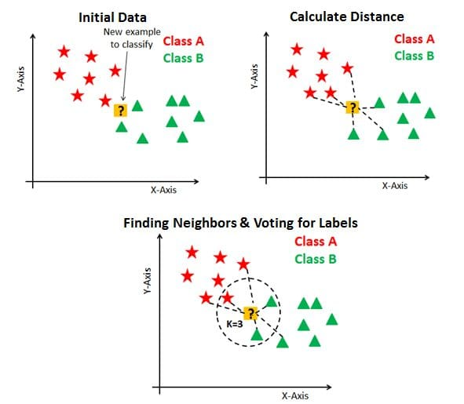

# K-Nearest Neighbors Algorithm

The **K-Nearest Neighbors (KNN)** algorithm relies on a user-defined constant, $k$, to make predictions for new, unlabeled data points based on the values of the $k$ nearest labeled data points.

## For Classification:

An unlabeled point is assigned the label that is most common among its $k$ nearest neighbors in the training set. This is essentially a **majority vote** among the closest samples.

## For Regression:

The prediction is computed as the **average** of the numerical target values of the $k$ nearest training examples.

---

## Formal Definition

Given a query input $x$, the prediction $\hat{f}(x)$ in a k-NN model is defined as:

$$
\hat{f}(x) = \frac{1}{k} \sum_{x_i \in \mathcal{N}_k(x)} y_i
$$

where $\mathcal{N}_k(x)$ denotes the neighborhood of $x$, consisting of the $k$ points in the training set that are closest to $x$ based on a distance metric — typically **Euclidean distance**.

---

## Distance Metric

The Euclidean distance between two data points $\mathbf{p}, \mathbf{q} \in \mathbb{R}^n$ is defined as:

$$
d(\mathbf{p}, \mathbf{q}) = \sqrt{\sum_{i=1}^{n}(p_i - q_i)^2}
$$

This metric determines which training points are considered "nearest" to the query point. In our implementation, we will also use the absolute value distance function.

---

## Classification vs. Regression

* In **classification**, labels are treated as binary (e.g., 0 and 1). The predicted output is the proportion of neighbors with label 1, effectively performing a majority vote.
* In **regression**, labels are continuous values, and the prediction is simply the **mean** of the neighbors’ outputs.

---

## Training-Free Model

KNN is known as a **lazy learning algorithm**, meaning it does not involve an explicit training phase. Instead, the algorithm memorizes the training dataset and performs all computation during prediction time. This makes it simple but potentially expensive in terms of computation for large datasets.

---
 ## The Dataset

 We will use the same penguins dataset as previously.

 ## Packages

 New to this module are the [`model_selection`](https://scikit-learn.org/stable/api/sklearn.model_selection.html), [`linear_model`](https://scikit-learn.org/stable/api/sklearn.linear_model.html), and [`metrics`](https://scikit-learn.org/stable/api/sklearn.metrics.html) packages.
