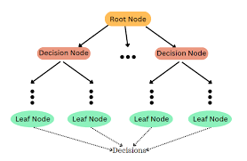

# Decision Tree and Regression Tree Model

Decision Trees are non-parametric, supervised learning models used to make predictions based on learned decision rules derived from data features.

They are popular because they:

- Are intuitive and easy to interpret
- Can handle both numerical and categorical data
- Work for both classification and regression problems
- Require minimal data preprocessing

Some disadvantages include:

- With too many layers, the model can **overfit** to the training data
- If data is rotated, it can lead to decreased performance, even if nothing else is changed
- Outliers can cause the boundaries to take on strange shapes

A decision/regression tree is composed of:

- Root Node: The starting point that splits the data based on a feature

- Decision Nodes: Intermediate nodes where further splitting occurs

- Leaf Nodes: Terminal nodes that hold the final prediction value

Each split is made to reduce impurity (e.g., gini score or squared error in regression) and improve the model’s ability to predict the target variable.