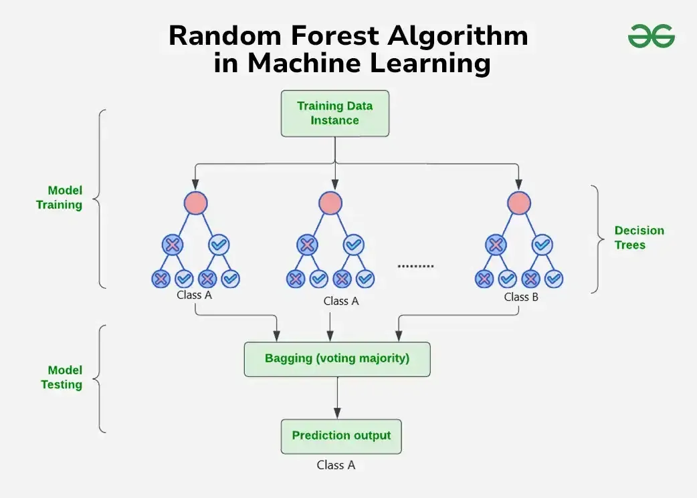

# Ensemble Boosting & Random Forests

Ensemble learning combines multiple models to improve the accuracy and robustness of predictions. Ensemble methods aim to opitimze for the strengths and limitation of its various models. Applicable to both regression and classification problems, ensembles can be formed from multiple instances of the same model or a mix of different models tailored to the problem. For classification problems, ensemble models make predictions by aggregating the outputs of individual classifiers— typically through a majority vote to determine the final label.

Boosting is an **ensemble learning technique** in machine learning that aims to combine multiple weak learners (typically decision trees) to create a strong learner with better predictive performance. A **weak learner** is a model that performs only slightly better than random guessing. In boosting, the most common weak learner is a shallow decision tree (aka, "decision stump").

Advantages:
- Reduces bias and variance, especially in over-simplified models
- Works well with both classification and regression problems

Disadvantages:
- Slower to train compared to simpler models
- Prone to overfitting if not properly normalized
- Harder to interpret than single decision trees

## Gradient Boosting

This method builds an ensemble of learners sequentially, where each new model is trained to correct the errors of its predecessor. Gradient boosting directly fits the new model to the predecessor's residual errors.

Given input vectors X and target values y, we begin by training a regression tree. This model makes predictions denoted by ŷ₁ (a vector of real values). Then, we can express the relationship as:

  y = ŷ₁ + error₁
  ⟹ error₁ = y − ŷ₁

We now train a second regression tree on the same features X, but with labels equal to the residuals: y₂ = y − ŷ₁. This new model predicts a vector ŷ₂, and we can write:

  error₁ = y₂ = ŷ₂ + error₂

Substituting back, we get:

  y = ŷ₁ + error₁ = ŷ₁ + ŷ₂ + error₂

Since error₂ < error₁, combining the first and second trees gives a more accurate prediction than using the first tree alone. This iterative refinement is the key strength of gradient boosting.

## AdaBoost

With AdaBoost, the algorithm begins by training a base classifier on the dataset and evaluating its predictions. Training instances that are misclassified are assigned higher weights, indicating they are harder to classify correctly. The core concept behind the model is that when a classifier misclassifies a point, that point is boosted—its influence is increased—so future classifiers are better equipped to handle it. The next classifier is then trained on this reweighted dataset, placing more emphasis on the difficult cases. This process repeats, with each new model focusing increasingly on the errors of its predecessors.

## Random Forests

Random forests are a versatile ensemble learning method used for both classification and regression tasks in machine learning. The algorithm operates by constructing a large number of decision trees during training and outputting the average prediction (in regression) or majority vote (in classification) of the individual trees. Unlike a single decision tree, which can easily overfit to training data, a random forest introduces randomness by training each tree on a different random subset of the data (using **bootstrapping**, see below) and selecting a random subset of features at each split. This technique, known as **bagging** (bootstrap aggregating), helps reduce variance and improve the model's generalization to unseen data. Random forests are especially effective because they combine the simplicity of decision trees with the power of ensemble methods, often yielding high accuracy without requiring extensive parameter tuning. Additionally, they provide insights into feature importance, making them valuable not only for prediction but also for interpreting which inputs contribute most to the model's decisions.

- "Bootstrapping" is the process of creating multiple subsets of the training data by randomly sampling from the original dataset with replacement. Each of these subsets is then used to train a separate model (e.g., a decision tree). Because the samples are drawn with replacement, some data points may appear multiple times in a given subset, while others may be left out. This introduces variability among the models, which helps reduce overfitting and improves the ensemble’s ability to generalize to new data.

## The dataset

For the AdaBoost model, we will use the penguins dataset, while for the Gradient Boosting model, we will generate non linear data.

## Packages

In addition to previous packages from sklearn, we use:

- [Ensemble](https://scikit-learn.org/stable/api/sklearn.ensemble.html)

