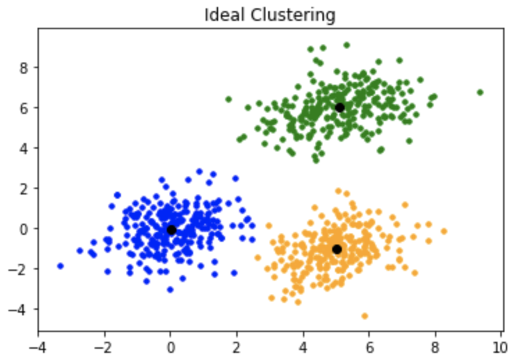

# K-Means Clustering

K-Means is an unsupervised machine learning algorithm used for partitioning data into **k** distinct clusters based on feature similarity. It is widely used in applications such as image compression, market segmentation, pattern recognition, and more.

## Algorithm

Given a set of data points in ℝⁿ, the K-Means algorithm seeks to partition the data into **k** clusters such that each point belongs to the cluster with the nearest mean (centroid).

The goal is to minimize the **within-cluster sum of squares** (WCSS), also known as **inertia**:

arg minₛ ∑ᵢ ∑ₓ∈Sᵢ ‖x − μᵢ‖²

Where:
- `Sᵢ` is the set of points in cluster `i`
- `μᵢ` is the centroid of cluster `i`
- `‖x − μᵢ‖²` is the squared Euclidean distance

### Algorithm Steps

1. **Initialization**: Choose `k` initial centroids randomly from the dataset.
2. **Assignment Step**: Assign each data point to the nearest centroid.
3. **Update Step**: Recalculate centroids as the mean of all points assigned to each cluster.
4. **Repeat** steps 2 and 3 until convergence or for a fixed number of iterations.

## The dataset

We will use the penguins dataset.

## Packages

In addition to previously packages, I used:

- [matplotlib.colors](https://matplotlib.org/stable/api/colors_api.html#module-matplotlib.colors)

