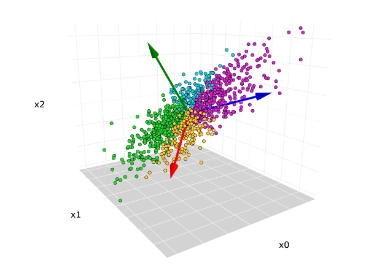

# Principal Component Analysis (PCA)

**Principal Component Analysis (PCA)** is a dimensionality reduction technique that transforms a dataset into a new coordinate system, where the greatest variances lie on the first axes (the principal components).



## PCA algorithm

Given a data matrix **X** of shape (n\_samples × n\_features), center the data:

```
A = X − mean(X, axis=0)
```

Compute the covariance matrix **C** (unbiased estimator):

```
C = (1/(n−1)) · Aᵀ · A
```

Solve the eigenvalue problem:

```
C · vᵢ = λᵢ · vᵢ  for i = 1…k,  where λ₁ ≥ λ₂ ≥ … ≥ λ_k ≥ 0
```

* **vᵢ** are the principal directions (eigenvectors).
* **λᵢ** are the variances explained by each component (eigenvalues).

Equivalently, using SVD on the centered data A:

```
A = U · Σ · Vᵀ
```

* Columns of V are the principal directions.
* Singular values σᵢ relate to variances by λᵢ = σᵢ²/(n−1).

## Algorithm Overview

1. **Center Data**: Subtract the column means to get zero-mean features.

2. **Compute Covariance**: Form C = (1/(n−1)) · Aᵀ · A.

3. **Eigen Decomposition**: Find eigenvalues λ₁…λ\_k and eigenvectors v₁…v\_k of C.

4. **Sort Components**: Order eigenvectors by descending eigenvalues.

5. **Project Data**: For r ≤ k, form projection matrix W₍r₎ = \[v₁ … v\_r] and compute:

   ```
   X_r = A · W₍r₎     (n_samples × r)
   ```

6. **Reconstruct (optional)**: Approximate original data by:

   ```
   ̶X ≈ X_r · W₍r₎ᵀ + mean(X, axis=0)
   ```

## Advantages

* **Dimensionality Reduction**: Compress data with minimal loss of variance.
* **Noise Filtering**: Discards components with low variance (often noise).
* **Visualization**: Projects high-dimensional data to 2D/3D for plotting.
* **Orthogonal Components**: Principal components are uncorrelated.

## Disadvantages

* **Linearity**: Captures only linear relationships.
* **Interpretability**: Principal components are linear combinations, harder to interpret.
* **Scaling Sensitive**: Features must be standardized to unit variance.
* **Global Method**: Doesn’t capture local manifold structure.

---

*Note*: Always center (and typically scale) your features before applying PCA to ensure meaningful components.

### The dataset

Palmer Penguins!

### Packages

In addtion to previous packages, I used:

- [`sklearn.decomposition`](https://scikit-learn.org/stable/api/sklearn.decomposition.html)
