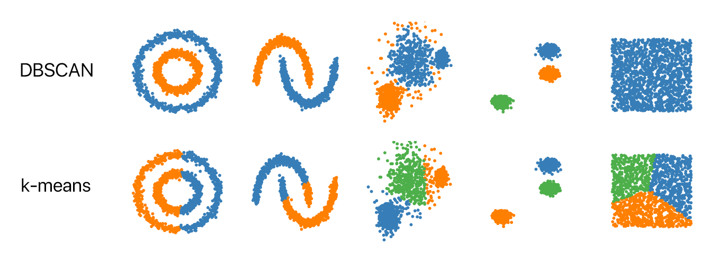

# DBSCAN

DBSCAN is a density-based clustering algorithm that groups together points that are closely packed and marks as outliers points that lie alone in low-density regions. It is particularly effective at discovering clusters of arbitrary shape and handling noise.

DBSCAN can also perform better than K-Means Clustering when the clusters are nested, because it focuses on finding a center and working outwards, while K-Means only considers distance, without taking into account the shape of the data. 

### DBSCAN Algorithm:

- Takes from the user its parameters
    - a radius
    - the number of points that must fall within a point's radius for it to be considered a core point
- Defines core points, working outwards through points within the predecessor's radius, until points are non-core
    - a non-core point can be defined in a cluster, but it cannot extend the cluster
- The points without a cluster are called **outliers** and they fall in low-density regions